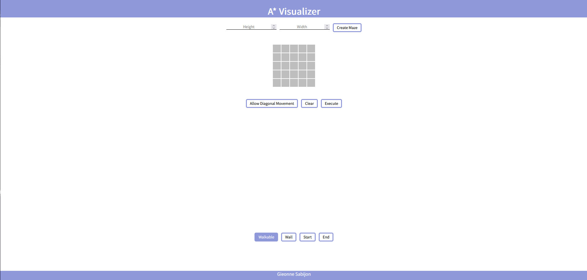
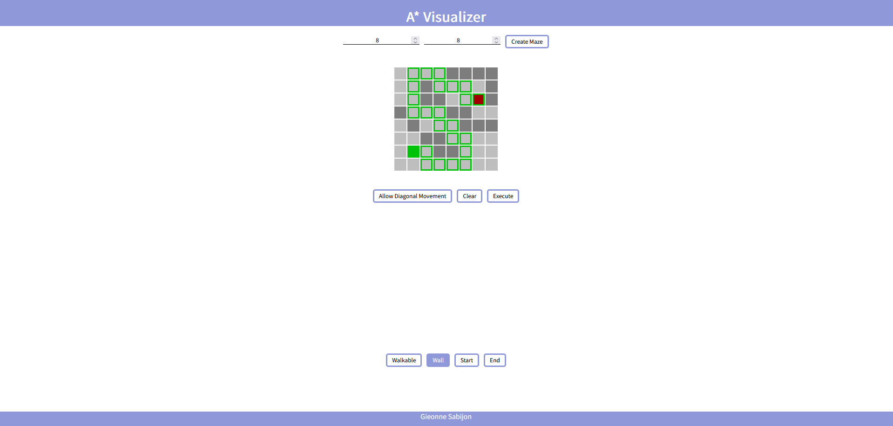

# A-Visualizer

This project is a website that demonstrates the A* pathfinding algorithm. The A* algorithm is a popular pathfinding algorithm used to find the shortest path between two points on a grid. 

# Demo
The live site is available [here](https://gieonnesabijon.pythonanywhere.com/) or copy and paste "https://gieonnesabijon.pythonanywhere.com/"

# Features

- Interactive Grid: The website provides an interactive grid where you can create walls and obstacles by clicking on the cells. These walls serve as obstacles that the algorithm must navigate around to find the optimal path.

- Start and End Points: You can set the starting and ending points on the grid. The algorithm will calculate the shortest path from the start to the end point while avoiding obstacles.

- Variable Size: The default size for the grid is 5x5 but you can change this to your liking to whatever reasonable size you please.
# Technologies Used

- HTML, CSS, JavaScript and, Python: The website is built using these fundamental web technologies to create the user interface and handle the interactivity with Python handling for the requests.

- A* Algorithm Implementation: The A* algorithm is implemented in Python where the client side makes an request call to the algorithm

- Flask was used as the framework for the Python request handler
# Contact

If you have any questions, suggestions, or feedback, feel free to reach out to the project maintainer:

    Gieonne Sabijon

Thank you for your interest in this project!